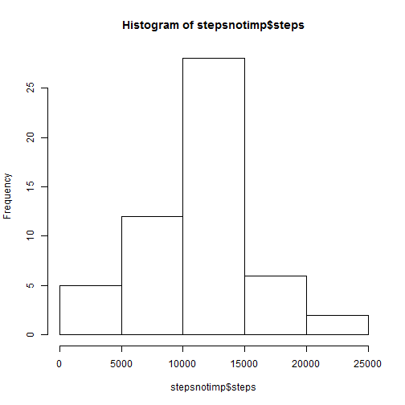
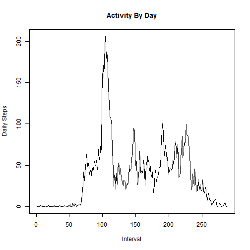
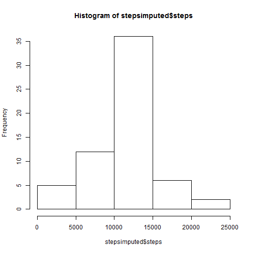

This is an R Markdown document created for the Reproducible Research course. For the first week project, we will load and process the movement activity recorded by monitoring devices.

As the first step, we need to load the activity file provided and display a summary of how it looks. See code:


```r
data <- read.csv("activity.csv")
summary(data)
```

```
##      steps                date          interval     
##  Min.   :  0.00   2012-10-01:  288   Min.   :   0.0  
##  1st Qu.:  0.00   2012-10-02:  288   1st Qu.: 588.8  
##  Median :  0.00   2012-10-03:  288   Median :1177.5  
##  Mean   : 37.38   2012-10-04:  288   Mean   :1177.5  
##  3rd Qu.: 12.00   2012-10-05:  288   3rd Qu.:1766.2  
##  Max.   :806.00   2012-10-06:  288   Max.   :2355.0  
##  NA's   :2304     (Other)   :15840
```

Since most of the required processing are based on the date column, we will make sure that this column is in right format:


```r
data$date <- as.Date(data$date)
```

At this point, we are ready to process. We need to aggregate the steps taken (provided in activity file) by the days. We need this to calculate mean as requested. Then, we need to display the histogram of the aggregate to show data by day.


```r
stepsnotimp <- aggregate(steps~cut(date, "day"), data=data, FUN=sum)
hist(stepsnotimp$steps)
```



Mean and median values of the total steps taken per day are calculated 


```r
meannonimputed <- mean(stepsnotimp$steps)
meannonimputed
```

```
## [1] 10766.19
```

```r
mediannonimputed <- median(stepsnotimp$steps)
mediannonimputed
```

```
## [1] 10765
```

We used the spread method in tidyr package to create the intervals and plot the daily activity at 5 minute intervals.


```r
require(tidyr)
```

```
## Loading required package: tidyr
```

```
## Warning: package 'tidyr' was built under R version 3.2.4
```

```r
stepintervals <- spread(data, interval, steps)
stepintervals <- stepintervals[-1]
stepmeanvals <- colMeans(stepintervals, na.rm = TRUE)
plot(stepmeanvals, type="l", xlab="Interval", ylab="Daily Steps", main="Activity By Day")
```



Now the averages that contain maximum number of steps are:


```r
which.max(stepmeanvals) 
```

```
## 835 
## 104
```

If you carefully look at the summary information of data loaded, you will see that there are 2304 N/As. 

I have decided to use column mean values to impute missing values on the column. First, we will make a copy of the non-imputed data and then replace the N/As in the new copy. That is done as follows:


```r
imputeddata <- data
for(i in 1:ncol(data)){
  imputeddata[is.na(imputeddata[,i]), i] <- mean(imputeddata[,i], na.rm = TRUE)
}
summary(imputeddata)
```

```
##      steps             date               interval     
##  Min.   :  0.00   Min.   :2012-10-01   Min.   :   0.0  
##  1st Qu.:  0.00   1st Qu.:2012-10-16   1st Qu.: 588.8  
##  Median :  0.00   Median :2012-10-31   Median :1177.5  
##  Mean   : 37.38   Mean   :2012-10-31   Mean   :1177.5  
##  3rd Qu.: 37.38   3rd Qu.:2012-11-15   3rd Qu.:1766.2  
##  Max.   :806.00   Max.   :2012-11-30   Max.   :2355.0
```

As you can see from the summary ablve that the NAs are gone. Now display the histogram from the imputed data for steps by day aggregate. 


```r
stepsimputed <- aggregate(steps~cut(date, "day"), data=imputeddata, FUN=sum)
hist(stepsimputed$steps)
```



Lets calculate the man and median now as follows:


```r
meanimputed <- mean(stepsimputed$steps)
meanimputed
```

```
## [1] 10766.19
```

```r
medianimputed <- median(stepsimputed$steps)
medianimputed
```

```
## [1] 10766.19
```

As you can see the mean and median values are same on the imputed data. The column mean did not affect the final results much.

To start working on the day of week results, lets add a two columns to the dataset to identify if it is a weekend and then to store the factor. We will then use the factor data to split data into two levels:


```r
imputeddata$weekend <- chron::is.weekend(imputeddata$date)
imputeddata$factor <- as.factor(imputeddata$weekend)

levels(imputeddata$factor)=c("weekday","weekend")
```


